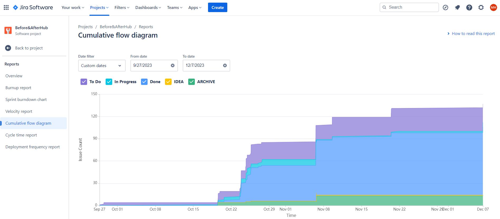
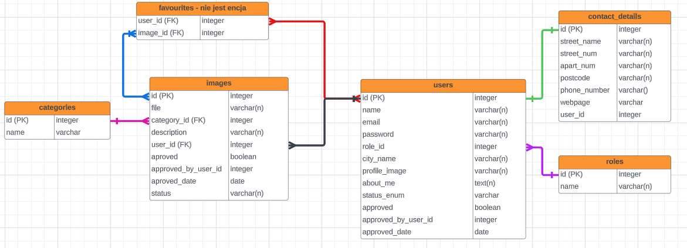
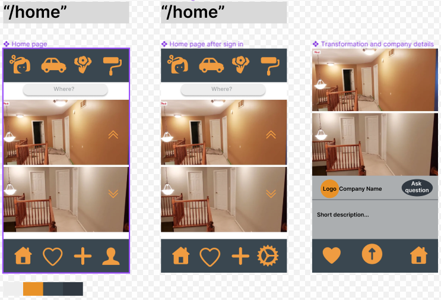
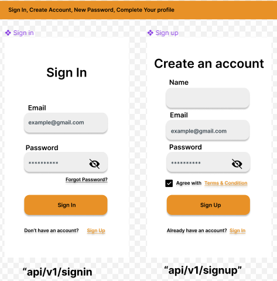

# Before After 

Here you can find repository with frontend part for this project:

- [Backend part](https://github.com/magdalenahuget/beforeAfterBackend)

## Table of Contents
* [General Info](#general-information)
* [Application Deployment Infrastructure](#application-deployment-infrastructure)
* [Planning](#planning)
* [Technologies Used](#technologies-used)
* [Features](#features)
* [Screenshots](#screenshots)
* [Setup](#setup)
* [Usage](#usage)
* [Project Status](#project-status)
* [Room for Improvement](#room-for-improvement)
* [Authors](#authors)

## General Information
The application revolutionizes service exploration through "before and after" photos, allowing users to easily filter and view transformations in various categories. It addresses the common issue of inadequate visual representation in service discovery, aiming to increase user comfort by streamlining decision-making through a visually rich platform. The project was initiated to simplify and enhance the service exploration process, providing users with comprehensive information for transparent and user-friendly service selection.

## Application Deployment Infrastructure

Explore our deployed application by clicking the link below:

- [before-after](https://magdalenahuget-before-and-after.vercel.app/)

### Note:
Please use the application carefully and patiently. The resources are hosted on free or almost free tiers, which may result in slower network performance. Be mindful of the allocated resources to ensure optimal usage within the constraints of the chosen pricing plans.

### Backend
- **Hosting: Azure Spring Apps**

  A fully managed service on Azure for deploying and scaling Spring Boot applications.
  Provides a scalable and reliable environment for running backend services.

### Frontend
- **Hosting: Vercel**

  A cloud platform specializing in static site deployment and serverless functions.
  Simplifies deployment and offers fast, secure hosting for the frontend application.

### Database
- Database Management System: PostgreSQL

  A powerful open-source relational database known for its reliability and extensibility.

- **Hosting: ElephantSQL**

  A cloud-based PostgreSQL service offering managed database hosting.
  Features include automated backups and scaling for efficient data storage.

This deployment infrastructure ensures a cloud-native, scalable, and reliable foundation for your web application, providing seamless integration between the backend logic, frontend user interface, and data storage.

## Planning
- **Jira software** was used to create tasks, divide them and track their progress.
  


- **Lucidchart** was used for database project creation.
  


- **Figma** was used to create project design.
  
  

## Technologies Used
- Javascript
- React
- MaterialUI

## Features
The features used in "Before After" allowed to build a fully functional web application in line with current trends.

|                                                          Technology Icon                                                      | Technology Name |                                Feature                                          |
|:------------------------------------------------------------------------------------------------------------------------------|:----------------|:------------------------------------------|
|  |   JavaScript    | Utilizing JavaScript extensively enables enhanced interactivity within the user interface. |
|  |      React	    | Component-based architecture, efficient one-way data binding, and extensive community support enable the development of a dynamic, reusable user interface with improved performance. |
|  |   Material UI   | Comprehensive set of pre-designed React components that provide a smooth and visually appealing user interface. |

## Screenshots


## Setup
1. *Install Git* - Make sure you have the Git version control system installed on your computer.
2. *Clone Repository* - Copy the project repository URL and clone it on your local computer using the following command in the terminal:

```
git clone <repository-url>
```

3. *Install Dependencies* - Install the required dependencies using the following command:

```
npm install
```

3. *Configure application* - Contact the project maintainers for API keys.
4. *Run the Application* - After completing the above steps, you can now run the application using the following command:

```
npm start
```

The application should be available at http://localhost:3000 in your web browser.

## Usage
- **Serach service:** User can easily filter services by categories and provided city.

- **Vieving transformations of selected service provider:** After selecting a specific service, the user can view all photos of metamorphoses performed by this service provider.

- **Registration and Login:** Users can create their accounts in the application, providing access to full functionality, adding makeovers to favorites and adding new makeovers.

- **Add new service transformation:** User can add their before and after transformation, but need first fill out their service details and contact information.

- **Add/remove transformation to favourites:** User can create a list of their favorite before and after photos or remove them from this list.

- **Add/edit service provider info:** Serice provider can edit and add their contact details so that customers can easily find and contact them.

## Project Status
Project is: _in progress_
Basic functionalities have been implemented. However, the application is being further developed and new features and improvements are being added.

## Room for Improvement
To do:
- add admin panel for approving resources and users
- improve responsiveness
- standardize component styling
- create docker compose version to run

## Authors
Magdalena Huget,
Marcin Kącki,
Patrycja Markiewicz
